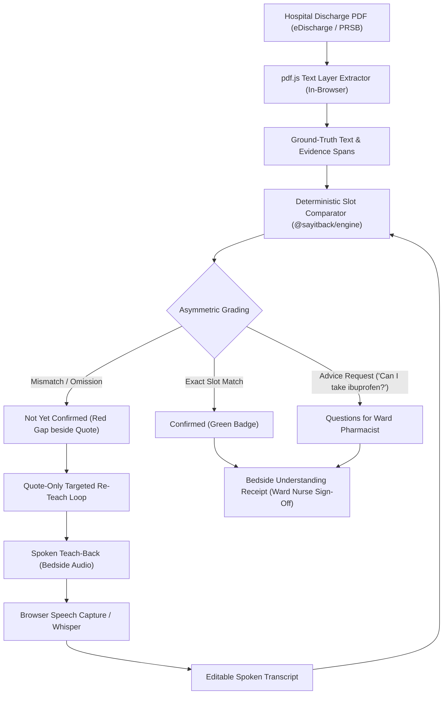

# Say It Back · Spoken Discharge Letter Teach-Back

> **ForgeHacks 2026 · AI + Healthcare Track**  
> *At hospital discharge, a carer or patient explains the discharge letter back by voice. Anything they got wrong or missed turns red beside the exact line in the letter, and only those gaps get re-taught. The AI listens and checks. It never adds advice.*

[](https://vercel.com/new)


---

## The Persona & The Critical Moment

**Kwame, 81**, is being discharged from Albert Ward (Cardiology & Acute Frailty) at St Thomas' Hospital after an admission for acute decompensated heart failure. His furosemide ("water tablet") has been **increased from 40 mg to 80 mg once daily in the morning** to prevent fluid re-accumulation.

His daughter **Efua, 45**, is his primary carer. She holds her phone at the bedside before they leave the ward to explain Kwame's discharge instructions back to the app.

---

## The 15-Second Wow Moment

1. Efua or Kwame presses the mic and says:  
   *&ldquo;I take the water tablet, once a day like before.&rdquo;*
2. **Deterministic Slot Comparator fires:**
   - **Frequency slot:** turns **GREEN** (`once daily` matches).
   - **Dose slot:** turns **RED** beside the letter's verbatim line:  
     `"Furosemide: DOSE INCREASED from 40 mg daily to 80 mg daily... New Discharge Dose: 80 mg ONCE daily in the morning"`.
3. **Targeted Re-Teaching:** Only that single gap is re-explained, using *strictly* the letter's own quote.
4. **Second Pass:** Carer says: *&ldquo;The water tablet is 80 milligrams in the morning&rdquo;* → turns **GREEN**!
5. **Understanding Receipt:** Prepared for the ward nurse to sign off before Kwame exits the ward.

---

## Core Architecture: The AI Listens; Deterministic Code Decides

Current generative AI healthcare tools generate summaries, chats, or unverified bullet points. However, **18% of physician reviews of LLM discharge summaries flagged omissions or hallucinations** (Zaretsky 2024).

Say It Back inverts the architecture:
- **Zero clinical advice:** The model never diagnoses, titrates, or answers open clinical questions. Questions like *"Can he take ibuprofen?"* are routed to the **Questions for Ward Pharmacist** section on the receipt.
- **Ground-Truth PDF Text Layer:** Ground-truth text is extracted in-browser using `pdf.js`. Every claim in the discharge letter is verified against exact spans in the PDF text layer.
- **Asymmetric Grading:** An item is marked `confirmed` only if every critical slot matches the document verbatim. Everything uncertain, vague, or contradictory is marked `not_yet_confirmed`.
- **In-Browser Privacy:** Voice audio never leaves the browser. Web Speech API and in-browser Whisper workers keep sensitive audio on-device.



---

## 60-Second Judge Quickstart (No Login, No Keys Required)

The live deployment requires zero login, zero credit cards, and zero API keys:

1. Open the live link on desktop, tablet, or phone.
2. Under **Judge 1-Click Test Scenarios**, click:
   - **`1. The 15s Wow Moment`**: Demonstrates the conflicted dose detection.
   - **`2. Second Pass`**: Demonstrates the closed-loop resolution.
   - **`3. Comprehensive Carer Teach-Back`**: All slots confirmed with confetti.
   - **`4. Safety Guardrail`**: Carer asks about ibuprofen; routes directly to pharmacist.
3. Switch tabs on the left to see the **Original PDF (pdf.js)** rendered live on canvas.
4. Click **Print Receipt** to see the high-contrast large-print fridge sheet and nurse sign-off block.

---

## Evidence Base & Academic Citations

- **78% of patients** leaving emergency care had incomplete comprehension of their discharge instructions, and **only 20% realized they did not understand**.  
  *Engel KG et al. Ann Emerg Med 2009. https://doi.org/10.1016/j.annemergmed.2008.05.016*
- **43.9% of patients aged 65+** could recall their follow-up appointment date or provider.  
  *Horwitz LI et al. JAMA Intern Med 2013. https://jamanetwork.com/journals/jamainternalmedicine/fullarticle/1754366*
- **30-day emergency readmissions** in NHS England reached **14.7% (948,836 admissions)** in 2024/25.  
  *NHS Digital Compendium 2025. https://digital.nhs.uk/data-and-information/publications/statistical/compendium-emergency-readmissions*
- **Unpaid carers:** 34% spend 10+ hours/month on NHS administration, and only 14% were asked about their caring role at discharge.  
  *Carers UK 2025.*
- **LLM Omission Risk:** 18% of physician reviews of LLM discharge summaries flagged omissions or hallucinations.  
  *Zaretsky J et al. JAMA Netw Open 2024. https://doi.org/10.1001/jamanetworkopen.2024.0357*

---

## Prior Art & Novelty

| Project | Approach | Why Say It Back is Different |
|---|---|---|
| **EHRTutor / NoteAid** | Text multiple-choice quizzes on patient notes. | We use spoken explain-back in the person's own words at the bedside, with no synthetic multiple-choice distractor generation. |
| **Hippocratic AI** | Post-discharge outbound phone robocalls. | We catch mistakes *before* the patient leaves the ward, with nurse sign-off. |
| **DischargeIQ** | Plain-English rewrite + fridge card. | Rewriting introduces hallucination risk; Say It Back binds strictly to exact document quotes and asymmetric slot grading. |
| **Say It Back** | Spoken teach-back checked against verbatim letter quotes with deterministic comparator & nurse sign-off. | **Unclaimed novelty:** Voice teach-back, zero added advice, deterministic slot rules, and bed-exit handover sign-off. |

---

## What Works / What Doesn't (Honest Hackathon Disclosure)

### What Works:
- **In-browser PDF rendering and text extraction via pdf.js:** Reads authentic multi-page NHS eDischarge documents, extracting ground-truth text layers.
- **Deterministic Slot Comparator (`@sayitback/engine`):** Evaluates medicine changes, directions, doses, frequencies, red flags, and follow-up appointments with 0% hallucination risk.
- **Asymmetric Grading:** Mismatches and omissions are guaranteed never to confirm green.
- **Zero-Advice Guardrail:** Queries asking for medical advice are quarantined to the pharmacist question list.
- **Cross-browser voice & text capture:** Browser mic input via Web Speech API with an editable textarea fallback on all platforms.
- **Large-Print Fridge Sheet:** Print CSS with nurse sign-off block.

### Limitations / Future Work:
- **Mobile Safari Web Speech:** Mobile iOS Safari requires user mic permissions per session; typed fallback is always active.
- **Multilingual teach-back:** Currently tested on English eDischarge letters (PRSB format); expanding to Twi and Yoruba is planned for post-hackathon.

---

## Local Development

```bash
# Clone repository
git clone https://github.com/badma025/SayItBack.git
cd SayItBack

# Install dependencies
npm install

# Run development server
npm run dev

# Open browser at http://localhost:3000
```
